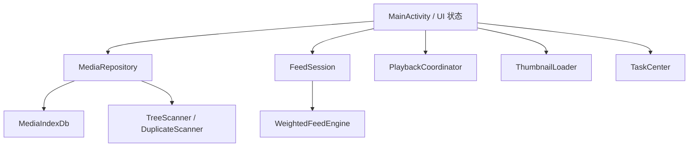
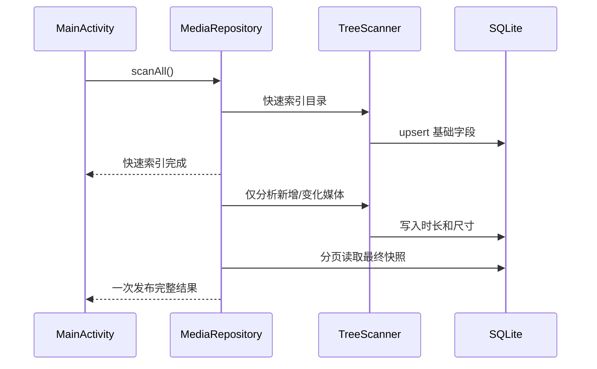

# LocalFeed

LocalFeed 是一个 Android 本地媒体浏览器，提供短视频式纵向 Feed、图片/视频相册、漫画式连续图片阅读、重复媒体清理、问题媒体诊断和持久任务中心。媒体文件保留在用户选择的普通目录中，应用通过 Android Storage Access Framework（SAF）取得访问权，并尝试在目录根部创建 `.nomedia`，减少系统相册和普通媒体选择器对该目录的展示。

> 当前开发分支：`localfeed-build`
>
> 当前版本：`0.7.3`（versionCode 15）
>
> Android 包名：`com.localfeed.app`
>
> 最低 Android 版本：Android 8.0 / API 26

## 项目状态

LocalFeed 目前处于持续真机反馈阶段，主要测试设备为 OnePlus Ace 6 / ColorOS 16。项目已经具备完整的源码构建、固定测试签名、GitHub Actions 校验、Release 发布和应用内检查更新链路。

当前重点是大媒体库稳定性。真实测试库包含 100 GB 以上、数千个视频和图片，因此所有涉及数据库读取、缩略图、元数据扫描、列表排序和删除队列的修改，都必须考虑内存、主线程耗时和进程被杀后的恢复。

## 功能概览

- 仅视频进入纵向 Feed；图片在相册、单图和瀑布流阅读器中浏览。
- Feed 默认均匀随机，可选轻度偏向点赞、收藏或未看过内容。
- 从筛选/排序后的相册打开视频时，播放顺序严格沿用当前相册顺序。
- 短视频每次从头播放；达到可配置阈值的长视频保存播放位置。
- 视频支持点赞累计、收藏、卡牌等级、特殊标记、铺满/完整显示、倍速和 2× 长按锁定。
- 横屏视频在竖屏 Feed 内固定完整显示，进入横屏全屏后使用横屏界面。
- 图片支持单图上下切换、双击放大、双指缩放、平移和连续瀑布流阅读。
- 相册支持类型、时长、方向、文件夹、问题媒体、重复媒体、收藏等筛选，以及多种排序。
- 重复视频扫描会自动选中建议删除项，保留项继承需要合并的状态。
- 问题媒体保留在原位置，可查看原因、外部打开、定位或删除。
- 扫描、诊断、下载更新和文件删除集中显示在任务中心。
- 永久删除和最近删除任务保存目标及完成点，应用中断后可以继续。
- 应用内检查 GitHub Release 更新，下载后校验 SHA-256，再交给系统安装器覆盖安装。

## 隐私与存储边界

- 应用没有服务器账户，也不会上传媒体内容。
- 媒体文件没有被加密；`.nomedia` 只负责隐藏常规图库索引，不提供安全隔离。
- SAF 授权可能在重装、清除数据或系统迁移后失效。权限失效时扫描会保留旧数据库记录，等待用户重新选择原目录。
- `android:allowBackup="false"`，应用数据不参与常规 Android 备份。
- 永久删除会调用文件提供器的删除接口，成功后无法通过 LocalFeed 恢复。

## 仓库结构

```text
.
├── README.md                              # 项目入口与完整接手说明
├── LocalFeed/                             # 可直接构建的 Android 项目
│   ├── app/src/main/                      # Kotlin 源码、布局和资源
│   ├── tools/                             # 纯 Kotlin 回归测试及 Android 桩
│   ├── CHANGELOG.md                       # 各版本真实变更记录
│   ├── TEST_REPORT.md                     # CI 与真机验收清单
│   ├── SOURCE_FILES.txt                   # 当前完整源码文件清单
│   └── README.md                          # Android 模块构建运行手册
├── localfeed_ci/
│   ├── v05_source_sha256.json             # 107 个正式源码文件的 SHA-256 门禁
│   ├── verify_v05_source.py               # UTF-8 与完整性校验
│   ├── stable_debug_keystore.b64          # 公开测试签名，仅用于连续覆盖安装
│   ├── update.json                        # 应用内更新的轻量清单
│   └── chunk_*/v0*_patch_*                # 历史恢复材料，当前构建不依赖
└── .github/workflows/
    ├── localfeed-v05-compile.yml          # 正式编译、签名、artifact、Release
    └── localfeed-build.yml                # 轻量 workflow 有效性检查
```

不要从 `localfeed_ci` 中的历史 Base64 分片重新生成当前源码。`LocalFeed/` 目录中的 UTF-8 文件是现行源码，历史分片只用于恢复早期版本。

## 技术栈

| 项目 | 当前配置 |
|---|---|
| 语言 | Kotlin，AGP 内置 Kotlin 支持 |
| JDK | 17 |
| Gradle | 9.6.0 |
| Android Gradle Plugin | 9.4.0 |
| compileSdk / targetSdk | 36 / 36 |
| minSdk | 26 |
| 播放器 | AndroidX Media3 ExoPlayer 1.11.0 |
| UI | 单 Activity、ViewBinding、RecyclerView、ViewPager2 |
| 存储 | SAF、DocumentsContract、DocumentFile |
| 数据库 | SQLiteOpenHelper，schema version 10 |
| 更新 | GitHub Release、DownloadManager、FileProvider |

## 架构总览



项目目前采用单 Activity。`MainActivity` 负责界面切换和跨模块协调，业务工作分别交给 Repository、Feed 会话、播放器、缩略图加载器和任务中心。继续开发时应避免把文件读取、排序、Diff、哈希或元数据解析放回主线程。

## 关键源码职责

### 入口与界面编排

- `MainActivity.kt`：创建所有模块，维护相册筛选状态、当前 Feed 位置、图片阅读状态、任务面板和系统栏；也是各 Adapter 与播放器回调的汇合点。
- `activity_main.xml`：相册、Feed、图片阅读器、任务中心和底部导航的统一容器。
- `item_feed.xml`：播放器、当前媒体缩略图、右侧操作轨道、进度条和错误提示。

### 媒体索引与文件操作

- `MediaIndexDb.kt`：媒体、目录、问题记录、重复/相似判断缓存及用户状态的 SQLite 存储。
- `TreeScanner.kt`：遍历 SAF 目录；第一阶段写入 URI、名称、大小、修改时间，第二阶段读取视频时长和媒体尺寸。
- `MediaRepository.kt`：为索引、元数据、重复扫描、诊断和文件写操作提供独立执行器，并用 `storageLock` 协调会修改存储状态的任务。
- `TrashManager.kt`：移动到 `.LocalFeedTrash`、恢复和永久删除；永久删除重试必须保持幂等。
- `DuplicateScanner.kt`：先快速哈希再完整哈希，仅处理完全重复视频。

### Feed 与播放

- `FeedSession.kt`：维护随机或有序视频队列。图片永远不会进入该队列。
- `WeightedFeedEngine.kt`：随机选择及轻度偏好；保证相同视频不会紧邻重复。
- `FeedAdapter.kt`：ViewPager 页面、真实缩略图、操作按钮、倍速手势和进度条。
- `PlaybackCoordinator.kt`：全应用复用一个 ExoPlayer，在页面之间移动同一个 PlayerView 目标。

播放器首帧规则非常重要：

1. 页面跟手移动时先显示该视频自己的缩略图。
2. 页面稳定后，只有当前播放请求可以挂载播放器。
3. ExoPlayer 的当前 `mediaId` 必须等于页面媒体 ID。
4. 真实首帧到达后，缩略图以短交叉淡出退出。
5. 不要假设 `STATE_READY` 与 `onRenderedFirstFrame()` 的固定先后顺序，不同编码器的回调顺序不同。

### 相册与图片阅读

- `AlbumQuery.kt`：类型、时长、方向、文件夹、特殊状态和排序的纯 Kotlin 查询逻辑。
- `AlbumAdapter.kt`：相册网格、日期分组、选择、高亮和卡牌边框。
- `ZoomImageView.kt`：单图矩阵缩放、平移、双击和上下切图。
- `ComicReaderAdapter.kt`：连续图片列表。
- `ComicReaderZoomTouchListener.kt`：整条瀑布流的缩放与横向焦点移动。
- `ThumbnailLoader.kt`：内存/磁盘缓存、前台大图队列、相册缩略图队列和动态图解码。

### 长任务与更新

- `TaskCenter.kt`：任务状态和持久化。高频进度采用限频写盘；任务开始、完成、失败等关键状态强制保存。
- `TaskCenterAdapter.kt`：任务中心列表。
- `AppUpdater.kt`：优先读取 `localfeed_ci/update.json` 的双线路清单，失败后回退 GitHub Release API。

## 数据流

### 扫描与增量导入



大媒体库约束：

- 列表查询必须使用明确字段，严禁 `SELECT *`。视觉哈希和完整哈希不能进入常规相册 Cursor。
- 完整媒体快照按 200 条分页读取，每页关闭 Cursor 后再继续。
- 正在复制且元数据尚未读通的新视频暂不进入播放队列，后续扫描成功后再发布。
- 快速索引阶段不向相册发布半成品数据，也不构造无用的完整列表。
- RecyclerView 只绑定屏幕附近项目；缩略图必须异步加载并在回收时取消。

### 随机与相册排序

相册“随机排列”和视频 Feed 随机是两套独立机制：

- 相册随机使用固定 `randomSeed` 计算稳定顺序。扫描、点赞或返回相册不会重新洗牌；用户再次选择“随机排列”才生成新 seed。
- 主动进入 Feed 时，`FeedSession` 建立随机视频队列并按需向后追加。
- 从筛选/排序相册打开视频时，`FeedSession.rebuildOrdered()` 使用当前可见视频顺序，不再随机。

### 删除与恢复

文件任务在执行前保存全部媒体 ID。每完成一个文件，任务记录完成点；进程中断后重新打开应用，从未完成目标继续。重试永久删除时，如果文件已经由文件提供器删除但 SQLite 尚未更新，应把“文件不存在”视为已完成并清理索引。

## 数据库说明

数据库文件为 `local_feed.db`，当前 schema version 为 10。

主要表：

- `media`：URI、相对路径、类型、大小、时长、尺寸、点赞次数、收藏、观看状态、播放位置、删除状态和哈希缓存。
- `folders`：已授权 SAF 根目录、显示名称、`.nomedia` 状态和最近扫描时间。
- `media_errors`：问题媒体的阶段、原因和更新时间。
- `similar_decisions`：历史相似判断结果；当前主界面已下线相似视频功能，但数据结构仍保留兼容。

升级数据库时只允许添加可迁移步骤，不能清空用户的点赞、收藏、播放位置、目录授权映射或删除任务状态。

## 本地构建

准备 JDK 17、Android SDK 36、build-tools 36.0.0 和 Gradle 9.6.0，然后执行：

```bash
cd LocalFeed
gradle :app:assembleDebug --stacktrace --no-daemon
```

执行纯 Kotlin 回归测试：

```bash
cd LocalFeed
bash tools/run-smoke-tests.sh
```

执行源码完整性检查：

```bash
python3 localfeed_ci/verify_v05_source.py
```

## CI、签名与发布

正式 workflow 是 `.github/workflows/localfeed-v05-compile.yml`，推送 `localfeed-build` 后会：

1. 校验正式源码文件的 SHA-256 和严格 UTF-8。
2. 运行 Feed、FeedSession、AlbumQuery 和扫描器回归测试。
3. 使用 Android SDK 36 完整编译 APK。
4. 使用固定测试 key 重新签名。
5. 校验证书 SHA-256。
6. 生成 APK、源码包、构建报告和 APK SHA-256。
7. 上传 Actions artifact，并发布或更新对应 GitHub Release。

固定测试证书 SHA-256：

```text
2F:CF:7E:D9:C4:82:3A:A9:58:9C:53:10:2B:55:9D:E2:74:B7:AB:84:F6:36:DE:D7:99:57:AA:88:74:6A:B7:A6
```

这把 key 已经公开，只用于测试包连续覆盖安装。任何正式公开发行都应启用新的私有签名、迁移策略和密钥保护流程。

## 发布新版本的必做清单

1. 修改 `LocalFeed/app/build.gradle.kts` 中的 `versionCode` 和 `versionName`。
2. 在 `LocalFeed/CHANGELOG.md` 顶部记录真实变更。
3. 在 `LocalFeed/TEST_REPORT.md` 顶部添加针对本轮问题的真机验收项。
4. 更新 `localfeed_ci/update.json` 的版本、说明、APK URL 和校验 URL。
5. 更新 `.github/workflows/localfeed-v05-compile.yml` 中的版本、文件名、Release tag 和构建报告。
6. 重新计算所有已修改 `LocalFeed/` 文件的 SHA-256，写入 `localfeed_ci/v05_source_sha256.json`。
7. 运行完整性、JSON、XML 和 `git diff --check`。
8. 推送 `localfeed-build`，等待正式 workflow 全部通过。
9. 核对 artifact 内 APK SHA-256 和固定签名证书，再交付真机。

版本号、workflow、更新清单或 Release tag 任何一处不一致，都会导致应用内更新、源码门禁或覆盖安装出问题。

## 测试策略

自动测试覆盖：默认均匀随机和可选偏好、FeedSession 随机/有序队列、相册筛选与稳定随机、扫描器缓存流程、Android 完整编译、源码完整性及固定证书。

自动测试无法代替 ColorOS 上 TextureView 与 ViewPager2 的真实首帧表现、100 GB 目录扫描、文件仍在复制时的读取、SAF 删除和权限撤销、特殊编码媒体及长时间内存压力。每次发布前必须结合 `LocalFeed/TEST_REPORT.md` 做真机回归。

## 当前边界与后续重点

- 快速连续切换视频时，当前视频缩略图与真实首帧采用短交叉淡出；仍需在目标 ColorOS 设备验证不同编码格式。
- 超大媒体库最终快照已经按页读取，但尚未完成万级媒体、持续扫描与批量删除并发的一小时压力测试。
- 相册查询在后台线程执行，大范围分类直接替换列表；后续可进一步把数据库层改为真正的分页 UI 数据源。
- Android SAF 没有可靠的跨应用实时目录通知。当前在应用从后台返回时自动检查，也保留手动扫描。
- 系统启动窗口无法彻底取消，只能使用无图案的纯黑主题缩短视觉干扰。
- 应用没有加密、账号同步、云端备份或跨设备同步。

## 人类或 AI 接手顺序

1. 阅读本 README，理解当前架构、构建和发布链路。
2. 阅读 `LocalFeed/CHANGELOG.md`，确认最近几版为何修改播放器、扫描和删除。
3. 阅读 `LocalFeed/TEST_REPORT.md`，了解尚需真机验证的行为。
4. 重点阅读 `MainActivity.kt`、`MediaRepository.kt`、`MediaIndexDb.kt`、`PlaybackCoordinator.kt` 和 `FeedAdapter.kt`。
5. 修改前检查 `git status`，保留用户已有改动。
6. 不要重新启用历史源码分片，不要更换包名或固定测试签名，不要把图片加入视频 Feed。
7. 性能修复必须保留当前观感：相邻页有本视频缩略图、真实首帧后平滑退出，后台扫描不弹窗打断播放。
8. 编译成功只能证明代码可构建；播放器闪屏和 100 GB 扫描必须以真机反馈为准。

## 历史来源

当前工程以完整 LocalFeed v0.4 源码 ZIP 为恢复基线，并合入 GitHub `localfeed-build` 分支中较新的 v0.5 及后续修改。早期相似视频源码曾因分片损坏而重建；当前构建已完全脱离分片还原流程。

详细版本记录见 [`LocalFeed/CHANGELOG.md`](LocalFeed/CHANGELOG.md)，真机验收项见 [`LocalFeed/TEST_REPORT.md`](LocalFeed/TEST_REPORT.md)。
